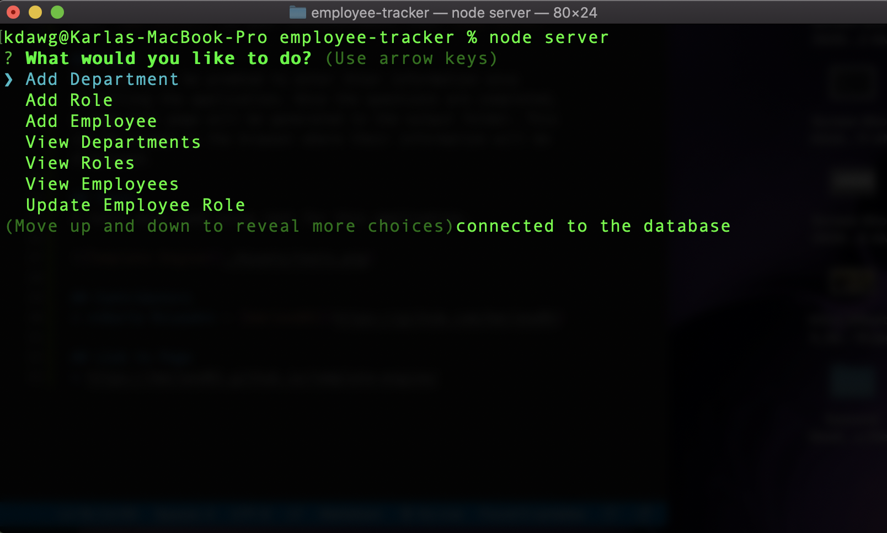

# employee-tracker

## Table of Contents:
* [Description](##Description)
* [How to Install](##How-to-Install)
* [Usage](##Usage)
* [Contributors](##Contributors)
* [Link to Page](##Link-to-Page)

## Description
This application is used to add, update and delete departments, roles and employees into a database connected to mysql.

## How to Install
run: `npm install` in your terminal/bash, then `node server`

## Usage
The user will be prompted to select what they want to do with a series of questions. Based on the users seletions, they will be prompted different options to add, update and delete information into a database.

## Contributors
* **Karla McLeod** - [kmcleod81](https://github.com/kmcleod81)

## Link to Page
* https://kmcleod81.github.io/employee-tracker/